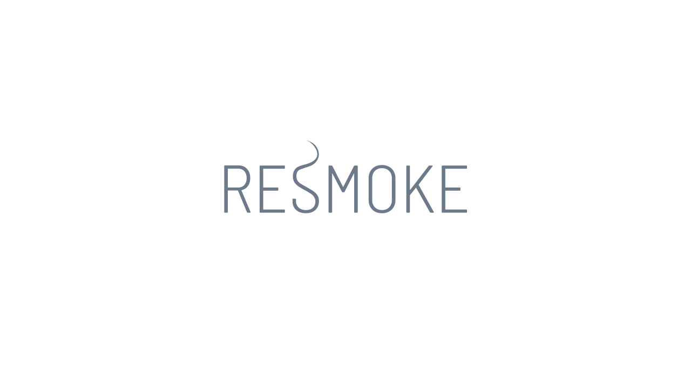

<p>
    
</p>

<p align="center">
    <b><h1 align="center">Resmoke</h1></b>
    <!-- <p align="center"><a href="https://www.npmjs.com/package/resmoke"></a></p> -->
    <div align="center">A test-case-based, action-based and in-browser front-end e2e test framework for single-page web applications.</div>
</p>

**Note:** The package is still in early development process.

# Installation

```bash
$ npm install resmoke@alpha --save-dev
```

or:

```bash
$ yarn add resmoke@alpha --dev
```


